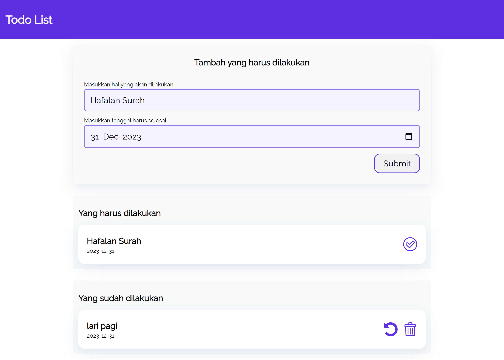

Ini merupakan aplikasi to do list

<ul>
 <li>Mampu Menambahkan Data Kegiatan baru. </li>
 <li>Memiliki Dua kategori Kegiatan. Yakni “Yang harus dilakukan” dan “yang sudah dilakukan”. </li>
 <li>Dapat Memindahkan Kegiatan antar kategori.</li>
 <li>Dapat Menghapus Data Kegiatan.</li>
 <li>Manfaatkan localStorage dalam Menyimpan kegiatan</li>
</ul>

berikut tampilannya:

link demo silahkan klik : https://bimahamdani93.github.io/todoApps/
